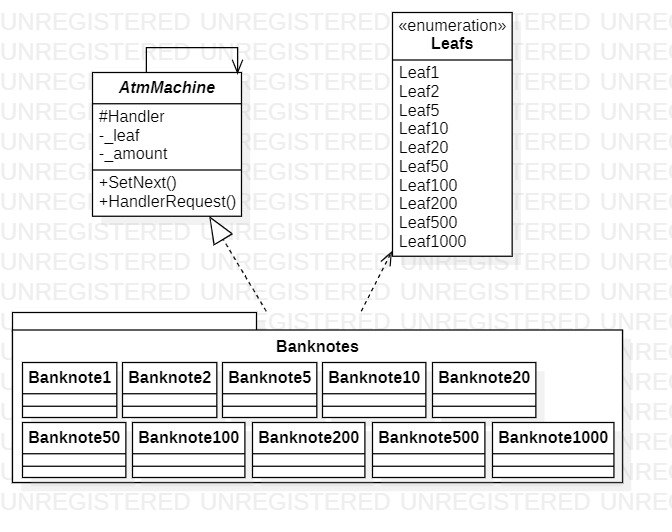

# Chain Of Responsibility
## Description
Chain of Responsibility is behavioral pattern from [*GoF catalog.*](https://en.wikipedia.org/wiki/Design_Patterns#Patterns_by_typehttps://en.wikipedia.org/wiki/Design_Patterns#Patterns_by_type)
**In this example, this pattern is used to demonstrate how ATM(Autoamted teller machine) works**.
## UML diagram

## How to use
To run the program and see the result, using pattern `Chain of Responsibility`, modify *`Main`* function in the next way (as an example):
```c#
private static void Main(string[] args)
{
    Behavioral.ChainOfResponsibility.
        ChainUsage.ConfigureAndRun(2500);

    System.Console.ReadKey();
}
```
