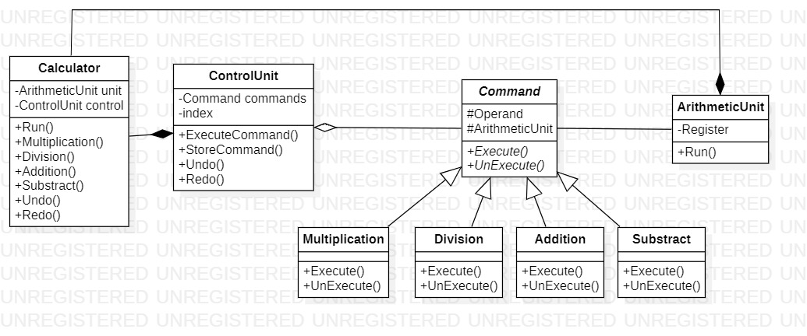

# Command
## Description
Command is behavioral pattern from [*GoF catalog.*](https://en.wikipedia.org/wiki/Design_Patterns#Patterns_by_typehttps://en.wikipedia.org/wiki/Design_Patterns#Patterns_by_type)
It is also known as *`Action`* or *`Transaction`* pattern. **In this example, this pattern is used to realize simplified
calculator with four basic arithmetic operations** (*Add*, *Sub*, *Div*, *Mult*).
## UML diagram

## How to use
To run the program and see the result, using pattern `Command`, modify *`Main`* function in the next way (as an example):
```c#
private static void Main(string[] args)
{
    var calculator = new Behavioral.Command.Calculator();
    int result = 0;

    result = calculator.Add(5);
    System.Console.WriteLine(result);

    result = calculator.Sub(4);
    System.Console.WriteLine(result);

    result = calculator.Undo(1);
    System.Console.WriteLine(result);
}
```
