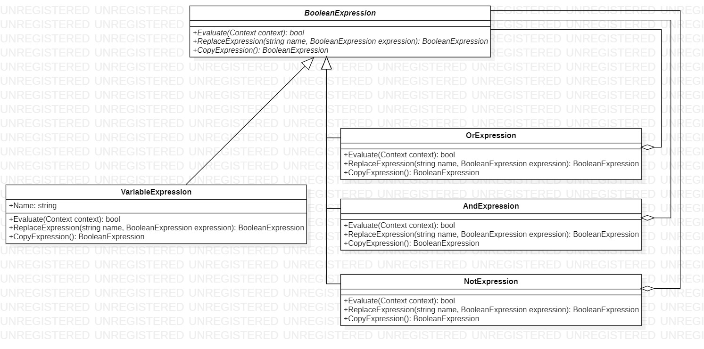

# Interpreter
## Description
Interpreter is behavioral pattern from [*GoF catalog.*](https://en.wikipedia.org/wiki/Design_Patterns#Patterns_by_typehttps://en.wikipedia.org/wiki/Design_Patterns#Patterns_by_type)
**In this example, a system for manipulating and evaluating boolean expressions implemented, using this pattern.  
Terminal symbols in this language are boolean variables, that is, the constants *TRUE* and *FALSE*. Nonterminal symbols represent expressions containing *AND*, *OR*, and *NOT* operators.**  
<ins>IMPORTANT (To simplify the task, we ignore the priorities of the operators and assume that their consideration is assigned to the object building the parse tree.)</ins>
## UML diagram

## How to use
To run the program and see the result, using pattern `Interpreter`, modify *`Main`* function in the next way (as an example):
```c#
/*
write two following lines before the namespace to run this code:
using Patterns.Behavioral.Interpreter;
using Patterns.Behavioral.Interpreter.ConcreteExpressions;
*/
private static void Main(string[] args)
{
    var context = new Context();

    var x = new VariableExpression("X");
    var y = new VariableExpression("Y");
    var z = new VariableExpression("Z");
    
    // The expression below: ((x and y) and z) or ((not x or not z) and true)
    BooleanExpression booleanExpression = new OrExpression(
        new AndExpression(new AndExpression(x, y), z),
        new AndExpression(new OrExpression(new NotExpression(x), new NotExpression(z)),
            new Constant().ReturnBooleanConstant(context, true)));

    context.Assign(x, false);
    context.Assign(y, true);
    context.Assign(z, true);

    var result = booleanExpression.Evaluate(context);

    System.Console.WriteLine($"The result is: {result}");

    System.Console.ReadKey();
}
```