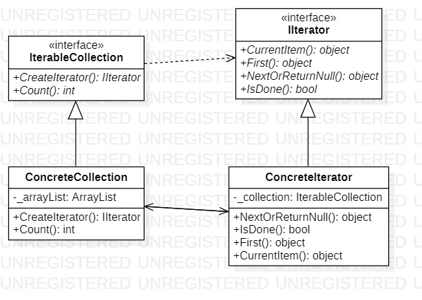
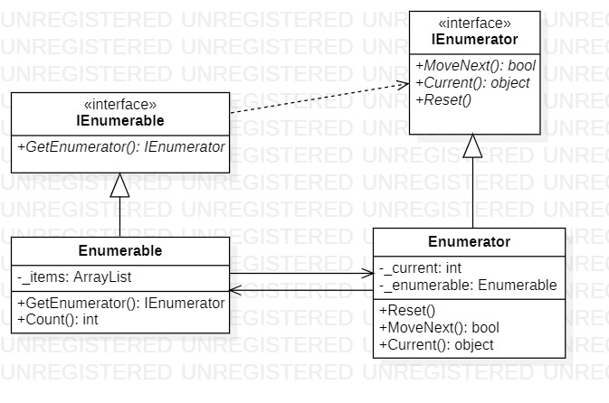

# Iterator
## Description
Iterator is behavioral pattern from [*GoF catalog.*](https://en.wikipedia.org/wiki/Design_Patterns#Patterns_by_typehttps://en.wikipedia.org/wiki/Design_Patterns#Patterns_by_type)
It is also known as *`Cursor`* pattern. **In this example, this patterns illustrates a simple conceptual example of iterating over a heterogeneous collection.**
But two approaches are used:
* [Classic view](https://github.com/YarKa03Coder/Patterns/tree/main/Patterns/Patterns/Behavioral/Iterator/ClassicRepresentation)
* [Microsoft .NET representation](https://github.com/YarKa03Coder/Patterns/tree/main/Patterns/Patterns/Behavioral/Iterator/.NETRepresentation)
## UML diagrams
|  |
|:--:| 
| *Classic representation* |

|  |
|:--:|
| *Microsoft .NET representation* |
## How to use
To run the program and see the result, using pattern `Iterator`, modify *`Main`* function in one of the following way (as an example):
### Classic view
```c#
private static void Main(string[] args)
{
    var collection = new Behavioral.Iterator.ClassicRepresentation.ConcreteCollection
    {
        [0] = "Element first",
        [1] = "Element second",
        [2] = "Element third"
    };

    var iterator = collection.CreateIterator();

    for (; !iterator.IsDone(); iterator.NextOrReturnNull())
    {
        System.Console.WriteLine(iterator.CurrentItem);
    }
}
```
### Representation Microsoft .NET
```c#
private static void Main(string[] args)
{
    var collection = new Behavioral.Iterator.NETRepresentation.Enumerable()
    {
        [0] = "Element first",
        [1] = "Element second",
        [2] = "Element third"
    };

    foreach (var variable in collection)
    {
        System.Console.WriteLine(variable);
    }
}
```
