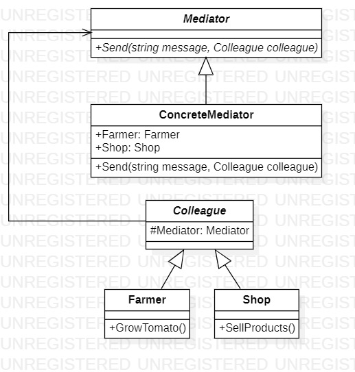
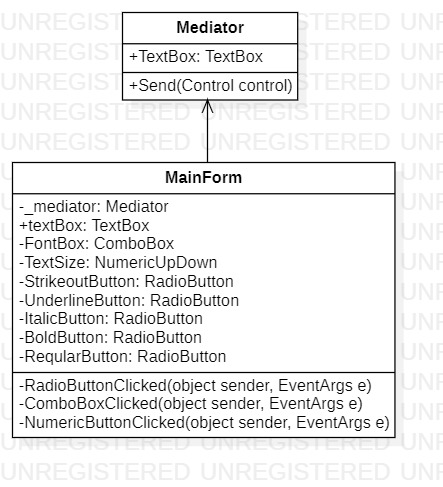
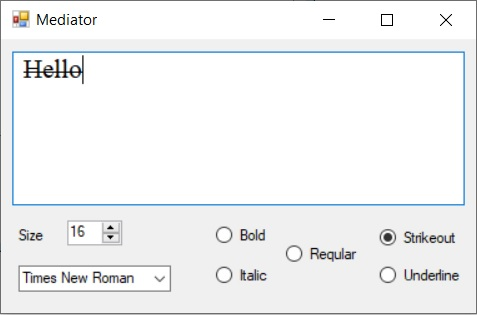

# Mediator
## Description
Mediator is behavioral pattern from [*GoF catalog.*](https://en.wikipedia.org/wiki/Design_Patterns#Patterns_by_typehttps://en.wikipedia.org/wiki/Design_Patterns#Patterns_by_type)
**In these examples, you could see how widely can you use this pattern. By the way,
the synonym of the Mediator is the Controller part of MVC pattern.**<br>Two examples are shown below:</br>
* [Conceptual Example](https://github.com/YarKa03Coder/Patterns/tree/main/Patterns/Patterns/Behavioral/Mediator/ConceptualExample)
* [GUI Example](https://github.com/YarKa03Coder/Patterns/tree/main/Patterns/Patterns/Behavioral/Mediator/GUIExample)
## UML diagram
|  |
|:--:| 
| *Conceptual Example* |

|  |
|:--:|
| *GUI Example* |
## How to use
To run the program and see the result, using pattern `Mediator`, modify *`Main`* function in one of the following way (as an example):
### Conceptual Example
```c#
private static void Main(string[] args)
{
    var mediator = new Behavioral.Mediator.ConceptualExample.ConcreteMediator();
    var farmer = new Behavioral.Mediator.ConceptualExample.ConcreteColleagues.Farmer(mediator);
    var shop = new Behavioral.Mediator.ConceptualExample.ConcreteColleagues.Shop(mediator);

    mediator.Farmer = farmer;
    mediator.Shop = shop;

    farmer.GrowTomato();

    System.Console.ReadKey();
}
```
### GUI Example
```c#
[System.STAThread]
private static void Main(string[] args)
{
    System.Windows.Forms.Application.EnableVisualStyles();
    System.Windows.Forms.Application.SetCompatibleTextRenderingDefault(false);

    var mediator = new Behavioral.Mediator.GUIExample.Mediator();
    var form = new Behavioral.Mediator.GUIExample.MainForm(mediator);

    mediator.TextBox = form.textBox;

    System.Windows.Forms.Application.Run(form);
}
```
As a result of `GUI Example`, you will see following:  

