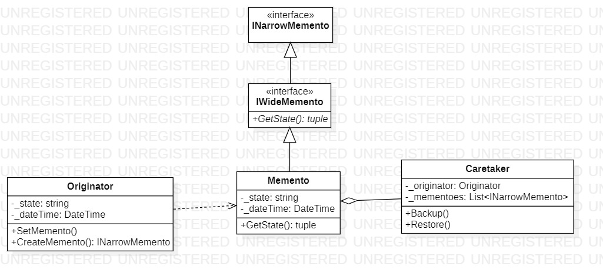

# Memento
## Description
Memento is behavioral pattern from [*GoF catalog.*](https://en.wikipedia.org/wiki/Design_Patterns#Patterns_by_typehttps://en.wikipedia.org/wiki/Design_Patterns#Patterns_by_type)
It is also known as *`Token`* pattern. **In this example, this pattern illustrates saving the state of the master object (or only part of the state), so that the master can be restored to it's original state later.**
## UML diagram

## How to use
To run the program and see the result, using pattern `Memento`, modify *`Main`* function in one of the following way (as an example):
```c#
private static void Main(string[] args)
{
    Behavioral.Memento.Originator originator = new Behavioral.Memento.Originator();

    Behavioral.Memento.Caretaker caretaker = new Behavioral.Memento.Caretaker(originator);

    caretaker.Backup();

    originator.State = "On"; // change state

    caretaker.Backup();

    caretaker.Restore();

    caretaker.Restore();

    System.Console.ReadKey();
}
```
