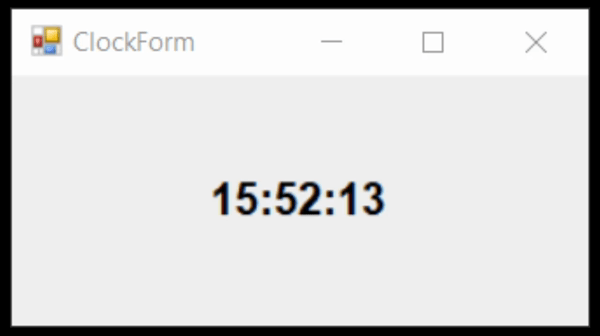

# Observer
## Description
Observer is behavioral pattern from [*GoF catalog.*](https://en.wikipedia.org/wiki/Design_Patterns#Patterns_by_typehttps://en.wikipedia.org/wiki/Design_Patterns#Patterns_by_type)
It is also known as *`Dependents`* or *`Publisher-Subscriber`* pattern. **In this example, this pattern is used to display time in digital format on the form.**
## UML diagram

## How to use
To run the program and see the result, using pattern `Observer`, modify *`Main`* function in the next way (as an example):
```c#
[System.STAThread]
private static void Main(string[] args)
{
    System.Windows.Forms.Application.SetCompatibleTextRenderingDefault(false);
    System.Windows.Forms.Application.EnableVisualStyles();

    #region Create instances of Form, Subject and Observers classes 

    var mainForm = new Behavioral.Observer.MainForm();

    Behavioral.Observer.Subject subject = new Behavioral.Observer.ConcreteSubjects.ClockTimer();

    Behavioral.Observer.Observer clock = new Behavioral.Observer.ConcreteObservers.DigitalClock(mainForm, subject);

    subject.Attach(clock);

    #endregion

    System.Windows.Forms.Application.Run(mainForm);
}
```
As a result, you will see following:


