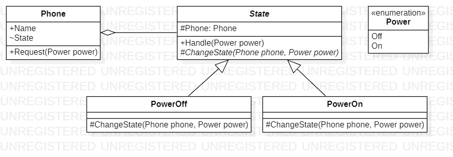

# State
## Description
State is behavioral pattern from [*GoF catalog.*](https://en.wikipedia.org/wiki/Design_Patterns#Patterns_by_typehttps://en.wikipedia.org/wiki/Design_Patterns#Patterns_by_type)
It is also known as *`FSM(Finite-State Machine)`* pattern. **In this example, this pattern illustrates simulation of the behavior of turning on / off the phone(Moore machine implementation).**
<br>There two known form of the finite-state machine: [*Moore machine*](https://en.wikipedia.org/wiki/Moore_machine) and [*Mealy machine*](https://en.wikipedia.org/wiki/Mealy_machine).</br>
Below you can see pictures in the form of the graph of these two types of finite-state machines for our task.

Moore machine             |  Mealy machine
:-------------------------:|:-------------------------:
.jpg)  |  .jpg)

## UML diagram

## How to use
To run the program and see the result, using pattern `State`, modify *`Main`* function in the next way (as an example):
```c#
private static void Main(string[] args)
{
    var phone = new Behavioral.State.Phone("Samsung Galaxy A10");

    phone.Request(Behavioral.State.Power.On);
    phone.Request(Behavioral.State.Power.Off);

    System.Console.WriteLine();
}
```
