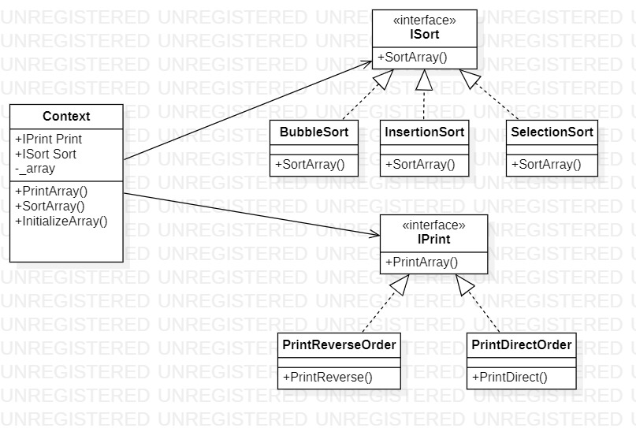

# Strategy
## Description
Strategy is behavioral pattern from [*GoF catalog.*](https://en.wikipedia.org/wiki/Design_Patterns#Patterns_by_typehttps://en.wikipedia.org/wiki/Design_Patterns#Patterns_by_type)
It is also known as *`Policy`* pattern. **In this example, this pattern is used to allow user sort and display arrays in different ways.**
By the way, constraints are used, so you allow to sort and display only `structures`, which realize `IConvertible` interface.
They are as follows:
* System.Boolean
* System.Byte
* System.Char
* System.DateTime
* System.Decimal
* System.Double
* System.Int16
* System.Int32
* System.Int64
* System.SByte
* System.Single
* System.UInt16
* System.UInt32
* System.UInt64
## UML diagram

## How to use
To run the program and see the result, using pattern `Strategy`, modify *`Main`* function in the next way (as an example):
```c#
private static void Main(string[] args)
{
    var sort = new Behavioral.Strategy.ISortStrategies.BubbleSort();
    var print = new Behavioral.Strategy.IPrintStrategies.PrintDirectOrder();

    var context = new Behavioral.Strategy.Context<int>(sort, print);
    context.InitializeArray(new[] { -10, 4, 29, 10, -5, 56 });

    context.SortArray();
    context.PrintArray();
}
```
