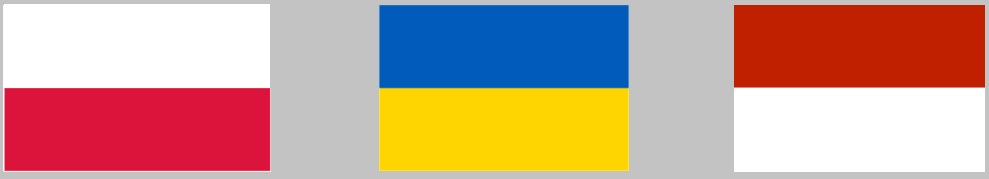
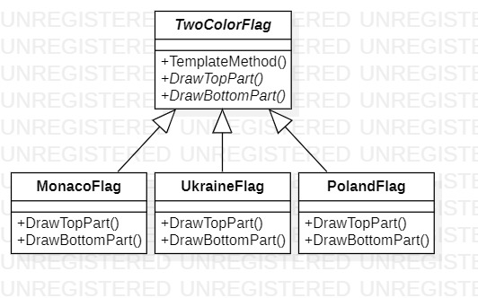

# Template Method
## Description
Template method is behavioral pattern from [*GoF catalog.*](https://en.wikipedia.org/wiki/Design_Patterns#Patterns_by_typehttps://en.wikipedia.org/wiki/Design_Patterns#Patterns_by_type)
**In this example, this pattern illustrates drawing two-color state flags, like in the picture below:**  

## UML diagram

## How to use
To run the program and see the result, using pattern `Template method`, modify *`Main`* function in the next way (as an example):
```c#
private static void Main(string[] args)
{
    Behavioral.TemplateMethod.TwoColorFlag colorFlag = new Behavioral.TemplateMethod.ConcreteClasses.MonacoFlag();
    colorFlag.TemplateMethod();

    System.Console.ReadKey();
}
```
