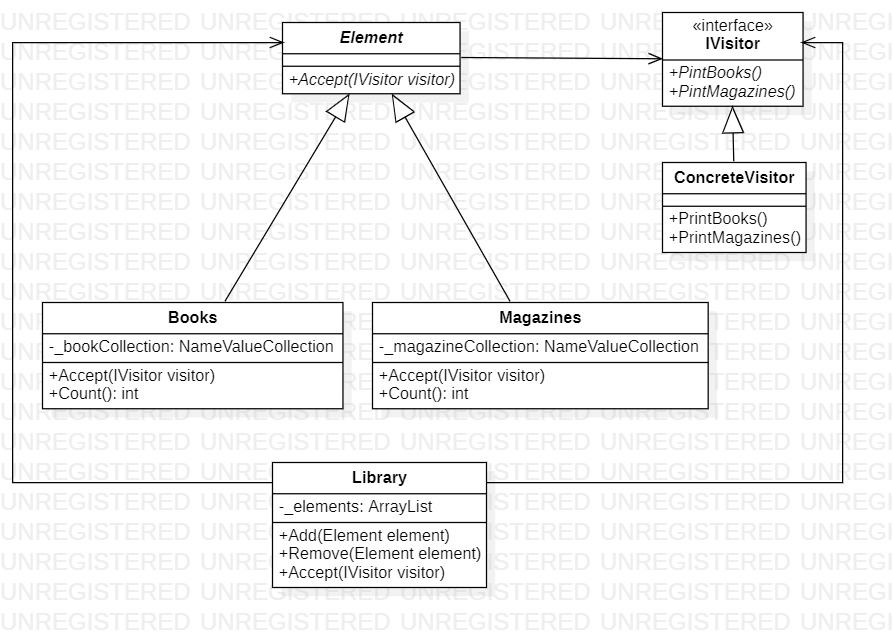

# Visitor
## Description
Visitor is behavioral pattern from [*GoF catalog.*](https://en.wikipedia.org/wiki/Design_Patterns#Patterns_by_typehttps://en.wikipedia.org/wiki/Design_Patterns#Patterns_by_type)
It is also known as *`Walker`* pattern. **In this example, this pattern organizes unified traversal of the elements of a heterogeneous collection, performing a specific inference operation on every available object.**
## UML diagram

## How to use
To run the program and see the result, using pattern `Visitor`, modify *`Main`* function in the next way (as an example):
```c#
private static void Main(string[] args)
{
    var library = new Behavioral.Visitor.Library();

    var books = new Behavioral.Visitor.ConcreteElements.Books
    {
        ["Jules Gabriel Verne"] = "Dick Sand, A Captain at Fifteen",
        ["Arthur Ignatius Conan Doyle"] = "Sherlock Holmes"
    };

    var magazines = new Behavioral.Visitor.ConcreteElements.Magazines
    {
        ["GameStop"] = "Game Informer",
        ["Time Inc."] = "TIME"
    };

    library.Add(books);
    library.Add(magazines);

    library.Accept(new Behavioral.Visitor.ConcreteVisitors.ConcreteVisitor());

    System.Console.ReadKey();
}
```