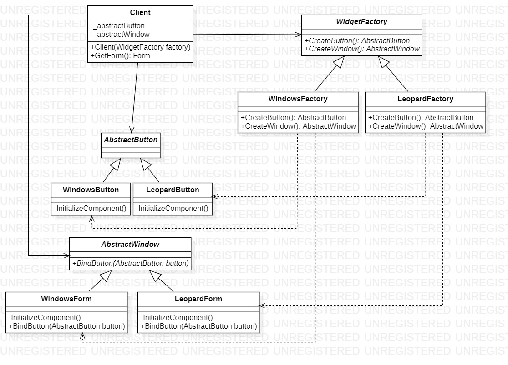

# Abstract Factory
## Description
Abstract Factory is creational pattern from [*GoF catalog.*](https://en.wikipedia.org/wiki/Design_Patterns#Patterns_by_typehttps://en.wikipedia.org/wiki/Design_Patterns#Patterns_by_type)
It is also known as *`Kit`* pattern. **In this example, this pattern is used to consider a simple program that supports the ability to create and use multiple user interface styles, such as the Windows Explorer style and the Mac OS Snow Leopard style.**
## UML diagram

## How to use
To run the program and see the result, using pattern `Abstract Factory`, modify *`Main`* function in the next way (as an example):
```c#
[System.STAThread]
private static void Main(string[] args)
{
    System.Windows.Forms.Application.SetCompatibleTextRenderingDefault(false);

    Creational.AbstractFactory.Client client = null;
    client = new Creational.AbstractFactory.Client(new Creational.AbstractFactory.Factories.WindowsFactory());

    System.Windows.Forms.Application.EnableVisualStyles();
    System.Windows.Forms.Application.Run(client.GetForm());
}
```
As a result, you will see following (it depends which factory (`WindowsFactory`, `LeopardFactory`) you use):
Example.jpg)

