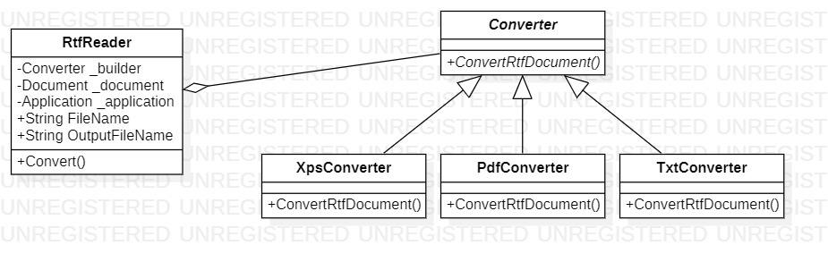

# Builder
## Description
Builder is creational pattern from [*GoF catalog.*](https://en.wikipedia.org/wiki/Design_Patterns#Patterns_by_typehttps://en.wikipedia.org/wiki/Design_Patterns#Patterns_by_type)
**In this example, this pattern is used to realize ability to convert `RTF` files to such formats: `PDF`, `TXT`, `XPS`.**
## UML diagram

## How to use
To run the program and see the result, using pattern `Builder`, modify *`Main`* function in the next way (as an example):
```c#
private static void Main(string[] args)
{
    Creational.Builder.Converter converter = new Creational.Builder.Converters.PdfConverter();

    var directorReader = new Creational.Builder.RtfReader(converter)
    {
        FileName = "C:\\Users\\AdMiN\\Desktop\\Course.docx",
        OutputFileName = "C:\\Users\\AdMiN\\Desktop\\Course.PDF"
    };

    directorReader.Convert();

    System.Console.ReadKey();
}
```
