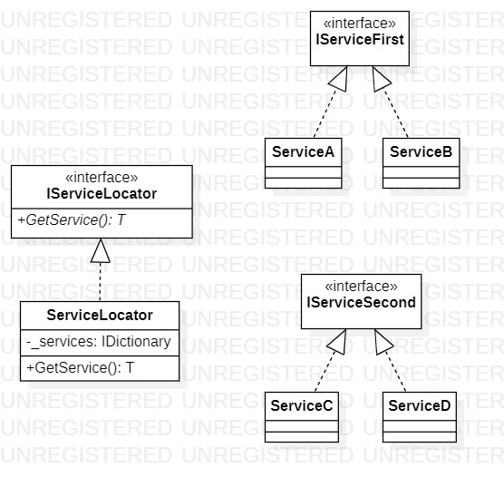

# Factory Method
## Description
Factory Method is creational pattern from [*GoF catalog.*](https://en.wikipedia.org/wiki/Design_Patterns#Patterns_by_typehttps://en.wikipedia.org/wiki/Design_Patterns#Patterns_by_type)
It is also known as *`Virtual Constructor`* pattern.  
**In this example, a conceptual usage of this pattern is shown. In conceptual example [Service Locator](https://en.wikipedia.org/wiki/Service_locator_pattern) (it is a design pattern used in software development to encapsulate processes associated with receiving a service with a strong level of abstraction).**
## UML diagram

## How to use
To run the program and see the result, using pattern `Factory Method`, modify *`Main`* function in the next way (as an example):
```c#
/*
write two following lines before the namespace to run this code:
using Patterns.Creational.FactoryMethod.Services;
using Patterns.Creational.FactoryMethod.Services.IServices;
*/
private static void Main(string[] args)
{
    Creational.FactoryMethod.Locator.IServiceLocator locator = new Creational.FactoryMethod.Locator.ServiceLocator();

    IServiceFirst serviceA = locator.GetService<ServiceA>();
    IServiceFirst serviceB = locator.GetService<ServiceB>();
    IServiceSecond serviceC = locator.GetService<ServiceC>();
    IServiceSecond serviceD = locator.GetService<ServiceD>();

    System.Console.WriteLine("If you see this message, all services are instantiated successfully");

    System.Console.ReadKey();
}
```
