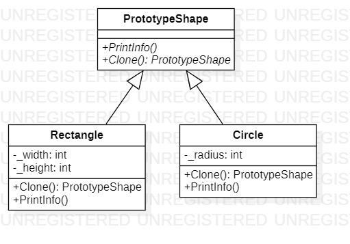

# Prototype
## Description
Prototype is creational pattern from [*GoF catalog.*](https://en.wikipedia.org/wiki/Design_Patterns#Patterns_by_typehttps://en.wikipedia.org/wiki/Design_Patterns#Patterns_by_type)  
**In this conceptual example of Prototype pattern, cloning is carried out using such shapes as rectangles and circles.  
By the way, shallow copy is used (that is, a copy of the value types) in this realization, because of using 
[MemberwiseClone](https://docs.microsoft.com/en-us/dotnet/api/system.object.memberwiseclone?view=net-5.0) method.**
## UML diagram

## How to use
To run the program and see the result, using pattern `Prototype`, modify *`Main`* function in the next way (as an example):
```c#
private static void Main(string[] args)
{
    Creational.Prototype.PrototypeShape prototypeShape = null;
    Creational.Prototype.PrototypeShape cloneShape = null;

    prototypeShape = new Creational.Prototype.Rectangle(12, 10);
    cloneShape = prototypeShape.Clone();

    System.Console.Write("Original: ");
    prototypeShape.PrintInfo();

    System.Console.Write("Clone: ");
    cloneShape.PrintInfo();

    System.Console.ReadKey();
}
```