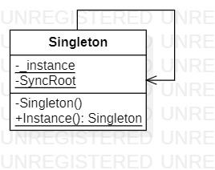
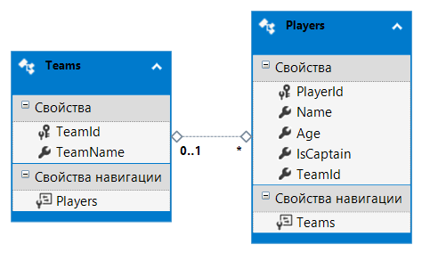

# Singleton
## Description
Singleton is creational pattern from [*GoF catalog.*](https://en.wikipedia.org/wiki/Design_Patterns#Patterns_by_typehttps://en.wikipedia.org/wiki/Design_Patterns#Patterns_by_type)
It is also known as *`Solitaire`* pattern. **In this example, the database connection class acts as a Singleton.**
## UML diagram


## Database
Simply database model with to tables (Team and Players) using `Code-First` approach and, also, `Data Annotations` for configurating the model.
Below you can see Entity Data Model XML as .bmp file:



## How to use
To run the program and see the result, using pattern `Singleton`, modify *`Main`* function in the next way (as an example).
<ins>Also remember, that you need to configure the connection string by yourself!</ins>
```c#
/*
write two following lines before the namespace to run this code:
using System;
using System.Linq;
*/
private static void Main(string[] args)
{
    var teamQuery = from teams in Creational.Singleton.Singleton.Instance.Teams
        select teams;

    Console.WriteLine($"{teamQuery}{'\n'}");

    foreach (var item in teamQuery)
    {
        Console.WriteLine($"{item.TeamId}.{item.TeamName}");
    }


    Console.WriteLine();


    var playersQuery = Creational.Singleton.Singleton.Instance.Teams.SelectMany(t => t.Players);

    Console.WriteLine($"{playersQuery}{'\n'}");

    foreach (var player in playersQuery)
    {
        if (player.TeamId != null)
            Console.WriteLine($"{player.PlayerId}.<{player.Name}, {player.Age}, {player.IsCaptain != null && player.IsCaptain.Value}, {player.TeamId.Value}>");
    }

    Console.ReadKey();
}
```
