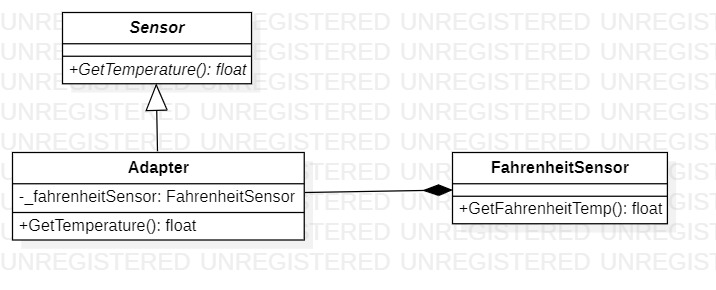

# Adapter
## Description
Adapter is structural pattern from [*GoF catalog.*](https://en.wikipedia.org/wiki/Design_Patterns#Patterns_by_typehttps://en.wikipedia.org/wiki/Design_Patterns#Patterns_by_type)
It is also known as *`Wrapper`* pattern. **In this conceptual example this pattern is used to adapt the readings of the temperature sensor of the climate control system, converting them from Fahrenheit to Celsius.**
## UML diagram

## How to use
To run the program and see the result, using pattern `Adapter`, modify *`Main`* function in the next way (as an example):
```c#
private static void Main(string[] args)
{
    Structural.Adapter.Sensor sensor = new Structural.Adapter.Adapter();
    System.Console.WriteLine($"Celsius temperature = {sensor.GetTemperature():F}");
    System.Console.ReadKey();
}
```
