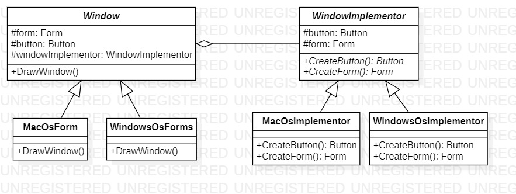

# Bridge
## Description
Bridge is structural pattern from [*GoF catalog.*](https://en.wikipedia.org/wiki/Design_Patterns#Patterns_by_typehttps://en.wikipedia.org/wiki/Design_Patterns#Patterns_by_type)
It is also known as *`Handle/Body`* pattern. **In this example, this pattern illustrates building an application that can use different user interface styles (for example, Microsoft Windows style and Mac OS style).**  
By the way, this task was also solved using the [**Abstract Factory**](https://github.com/YarKa03Coder/Patterns/tree/main/Patterns/Patterns/Creational/AbstractFactory) pattern.
## UML diagrams

## How to use
To run the program and see the result, using pattern `Bridge`, modify *`Main`* function in the next way (as an example):
```c#
private static void Main(string[] args)
{
    Structural.Bridge.Window windowMac = new Structural.Bridge.AbstractionRepresentatives.MacOsForm();
    windowMac.DrawWindow();

    Structural.Bridge.Window windowWin = new Structural.Bridge.AbstractionRepresentatives.WindowsOsForm();
    windowWin.DrawWindow();
}
```
As a result, you will see following (it depends which implementation of abstraction (`MacOsForm`, `WindowsOsForm`) you use):
Example.jpg)
