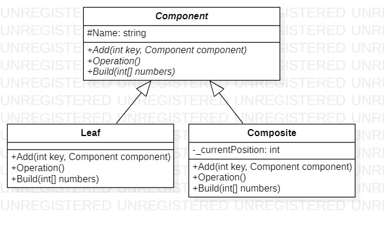

# Composite
## Description
Composite is structural pattern from [*GoF catalog.*](https://en.wikipedia.org/wiki/Design_Patterns#Patterns_by_typehttps://en.wikipedia.org/wiki/Design_Patterns#Patterns_by_type)  
**In this example, this pattern is used to build simple tree (Acyclic graph).  
The tree consists of two nodes (branches). Each of the nodes contains elements (leaves) representing even and odd numbers.**
## UML diagram

## How to use
To run the program and see the result, using pattern `Composite`, modify *`Main`* function in the next way (as an example):
```c#
private static void Main(string[] args)
{
    int[] arrayInts = { 0, 1, 2, 3, 4, 5, 6, 7, 8, 9 };

    Structural.Composite.Component componentTree = new Structural.Composite.Composite("root");
    componentTree.Build(arrayInts);

    componentTree.Operation();

    System.Console.ReadKey();
}
```