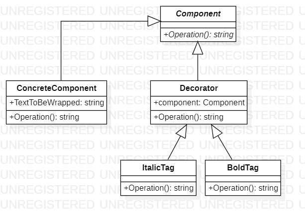

# Decorator
## Description
Decorator is structural pattern from [*GoF catalog.*](https://en.wikipedia.org/wiki/Design_Patterns#Patterns_by_typehttps://en.wikipedia.org/wiki/Design_Patterns#Patterns_by_type)
It is also known as *`Wrapper`* pattern. **In this example, this pattern illustrates simple wrapping text into tags.**
## UML diagram

## How to use
To run the program and see the result, using pattern `Decorator`, modify *`Main`* function in the next way (as an example):
```c#
private static void Main(string[] args)
{
    Structural.Decorator.Component component = new Structural.Decorator.ConcreteComponent() { TextToBeWrapped = "Decorator's simple example" };

    Structural.Decorator.Decorator squareBrackets = new Structural.Decorator.ConcreteWrappers.ItalicTag();
    Structural.Decorator.Decorator roundBrackets = new Structural.Decorator.ConcreteWrappers.BoldTag();

    squareBrackets.Component = component;
    roundBrackets.Component = squareBrackets;
    System.Console.WriteLine(roundBrackets.Operation());

    System.Console.ReadKey();
}
```