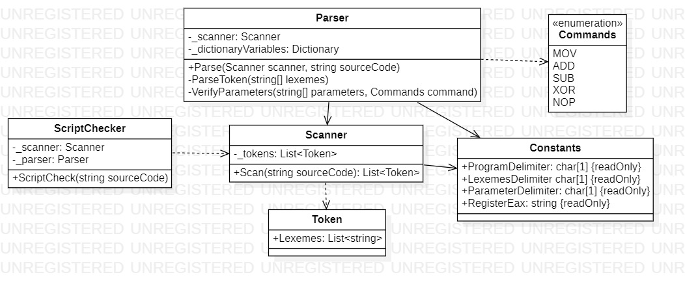

# Facade 
## Description
Facade is structural pattern from [*GoF catalog.*](https://en.wikipedia.org/wiki/Design_Patterns#Patterns_by_typehttps://en.wikipedia.org/wiki/Design_Patterns#Patterns_by_type)  
**In this example, a very simple syntax validator
for a limited number of mnemonics (instructions) of the Assembler language, using Facade pattern.**  
Instructions, which you could use:

* MOV
* ADD
* SUB
* XOR
* NOP  

A simple example, like below, is pasted into *`Main`* function, which demonstrates how the program works.
```assembly
var dd 12; 
mov eax, var; 
xor eax, eax; 
nop; 
mov var, 0; 
add eax, var
```  
By the way, <ins>you can only use DD (Define Doubleword => 4 bytes, int 
equivalent) for your variables</ins> in this program, because it's simple.
## UML diagram

## How to use
To run the program and see the result, using pattern `Facade`, modify *`Main`* function in the next way (as an example):
```c#
private static void Main(string[] args)
{
    var checker = new Structural.Facade.ScriptChecker();
    const string sourceCode = "var dd 12; " +
                              "mov eax, var;" +
                              "xor eax, eax;" +
                              "nop;" +
                              "mov var, 0;" +
                              "add eax, var";

    checker.ScriptCheck(sourceCode, System.Console.WriteLine);

    System.Console.ReadKey();
}
```