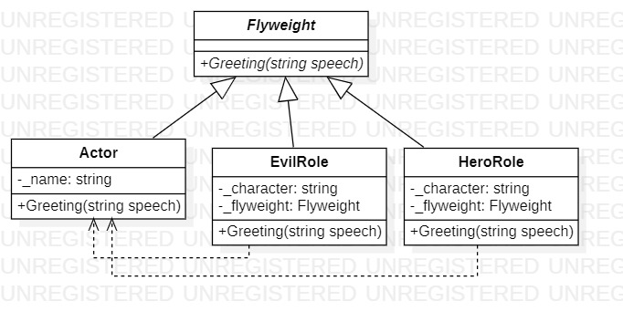

# Flyweight
## Description
Flyweight is structural pattern from [*GoF catalog.*](https://en.wikipedia.org/wiki/Design_Patterns#Patterns_by_typehttps://en.wikipedia.org/wiki/Design_Patterns#Patterns_by_type)  
**Consider a situation where one actor plays several roles in one movie at once, using Flyweight pattern.  
The actor himself is a "shared" object, while the roles-characters are "inseparable" objects.**
## UML diagram

## How to use
To run the program and see the result, using pattern `Flyweight`, modify *`Main`* function in the next way (as an example):
```c#
private static void Main(string[] args)
{
    var actor = new Structural.Flyweight.Actor("Mike Myers");

    var hero = new Structural.Flyweight.HeroRole(actor, "Austin Powers");
    hero.Greeting("Hello! I'm super hero, a positive character");

    var evil = new Structural.Flyweight.EvilRole(actor, "Doctor Evil");
    evil.Greeting("Hello! You know, I'm a bad character. Be afraid of me");

    System.Console.ReadKey();
}
```