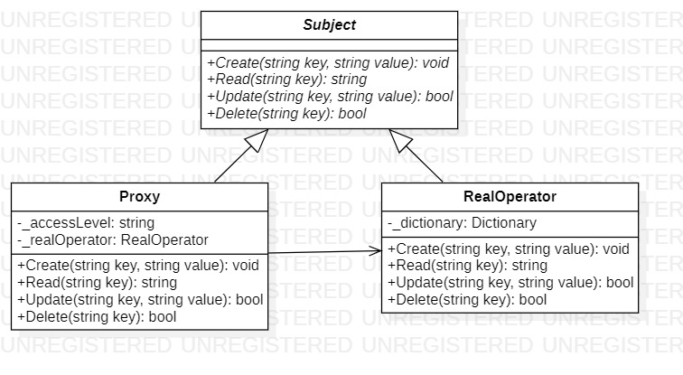

# Proxy
## Description
Proxy is structural pattern from [*GoF catalog.*](https://en.wikipedia.org/wiki/Design_Patterns#Patterns_by_typehttps://en.wikipedia.org/wiki/Design_Patterns#Patterns_by_type)
It is also known as *`Surrogate`* pattern.  
As you know, there are four types of proxy pattern, 
which are defined in [*Design Patterns: Elements of Reusable Object-Oriented Software (1994)*](https://en.wikipedia.org/wiki/Design_Patterns) book:

* Remote Proxy
* Virtual Proxy
* Protection Proxy
* Smart Proxy

**In this example, a protection proxy is realized. Such substitutes
used when you want to set different access rights to a target.  
For example, while implementing the CRUD (Create, Read, Update, Delete) approach popularized by James Martin.**

## UML diagram

## How to use
To run the program and see the result, using pattern `Proxy`, modify *`Main`* function in the next way (as an example):
```c#
/*
write following line before the namespace to run this code:
using System;
*/
private static void Main(string[] args)
{
    Structural.Proxy.ProtectionProxy.Subject subject = new Structural.Proxy.ProtectionProxy.RealOperator();

    Structural.Proxy.ProtectionProxy.Subject proxy =
        new Structural.Proxy.ProtectionProxy.Proxy(subject, "Owner");
    CrudInvoke(proxy, "Owner Name");

    proxy = new Structural.Proxy.ProtectionProxy.Proxy(subject, "User");
    CrudInvoke(proxy, "User Name");

    proxy = new Structural.Proxy.ProtectionProxy.Proxy(subject, "Administrator");
    CrudInvoke(proxy, "Administrator Name");

    Console.ReadKey();
}
```
The realization of `CrudInvoke` function is below:
```c#
private static void CrudInvoke(Structural.Proxy.ProtectionProxy.Subject proxy, string name)
{
    Console.WriteLine(name + ':');
    try
    {
        proxy.Create(name, "Some value here");
        Console.WriteLine("Status[Creation] - OK!");
    }
    catch (Exception e)
    {
        Console.WriteLine(e.Message);
    }

    try
    {
        proxy.Read("Pre-created Key");
        Console.WriteLine("Status[Read] - OK!");
    }
    catch (Exception e)
    {
        Console.WriteLine(e.Message);
    }

    try
    {
        proxy.Update(name, "Updated value here");
        Console.WriteLine("Status[Update] - OK!");
    }
    catch (Exception e)
    {
        Console.WriteLine(e.Message);
    }

    try
    {
        proxy.Delete(name);
        Console.WriteLine("Status[Delete] - OK!");
    }
    catch (Exception e)
    {
        Console.WriteLine(e.Message);
    }

    Console.WriteLine(new string('-', 10));
}
```